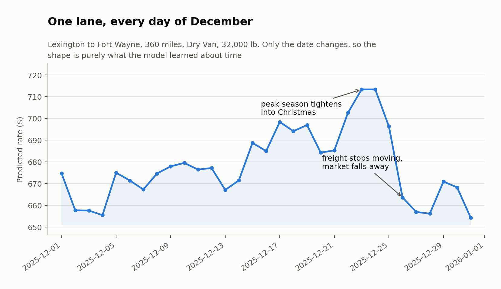

# Freight Rate Forecasting

Predicting what a truckload costs to move, 61 days ahead of the last label I have.

48,000 loads from January to October 2025 with the rate each was posted at. Then 12,000
loads running from 1 November to 31 December that I have to price without ever seeing an
answer for a single date I am scored on. The data is synthetic and I generated it, so the
whole problem is reproducible from a clean clone.

I built this to re-test something. On a tabular problem, how much of the result actually
comes from the model? The short answer is: much less than the parts nobody photographs.

**The model is off by $228.76 on average, 10.6%.** A global-constant baseline is off by
$364.93 and a lane-by-equipment median is off by $302.62. So 37.3% and 24.4% better
respectively, and which of those two numbers I quote says more about the baseline I picked
than about the model I built.



## Setup

```bash
python3 -m venv .venv
source .venv/bin/activate
pip install -r requirements.txt
python make_synthetic_data.py
```

## Running

```bash
python run.py verify      # 21 assertions that the generated data is the shape the code assumes
python run.py harness     # build the folds, price what a random split would have cost
python run.py ablation    # add one feature group at a time and measure each
python run.py train       # compare models, losses, hyperparameters
python run.py predict     # write the predictions and fill the December probe
python run.py all         # the lot, about eight minutes
python make_charts.py     # the figures in results/figures
```

## What I actually found

Six things carried the weight. Each is measured, and the numbers below all reproduce from
the committed code.

**Target framing beat model selection, and it was not close.** Distance correlates 0.885
with the rate, so predicting the rate directly spends the model relearning multiplication.
Predicting rate per mile and multiplying back cuts the coefficient of variation from 0.622
to 0.271, which is 56% of the variance gone before a model sees anything. For comparison,
switching from HistGradientBoosting to LightGBM moved the score by $7.77 against a
fold-to-fold spread of $30. One decision mattered. The other was a coin flip.

**A random split flatters this problem by $17.20, or 7.5%.** Training labels stop on 31
October and I am scored on the two months after, so I never see the answer for a date I am
graded on. A random split puts rows from every date in both halves, which lets the model
learn the market on the days it is being marked on. Nothing errors. You just get a better
number that means nothing. `src/split.py` runs both harnesses so the gap is a measurement
rather than a claim.

**Some of the error was never reachable.** 0.65% of loads are inflated at random. They
contribute $24.23 to the null baseline and $24.60 to the tuned model, which is the point:
that component does not move no matter how good the model gets. It is 10.8% of my remaining
error and the best achievable score on this data is bounded well above zero. I report
`mae_clean` alongside `mae` everywhere so the reachable part is visible.

**I threw away my most sophisticated feature.** `LaneEncoder` is a smoothed hierarchy, lane
falling back to its two cities and then to the global median, with expanding-window
encoding so no future rate leaks backwards. It cost $24.09. The median lane carries three
loads so a lane average is mostly noise, and the shrinkage that should rescue it also
strips out what made it worth having. Worse, training rows get encoded from earlier dates
only while scoring rows get the full statistics, so the two see systematically different
feature strengths. Native categorical splits on pickup and delivery do the same job without
either failure. It stays in the code, in `REJECTED`, because what I tested and dropped is
part of the result.

**The feature set I shipped is not the one that scored best.** Stopping at `+ lane native`
scores $219.06. What I shipped scores $228.76, so the calendar features cost $9.70 against
a $30.12 fold spread, which is a tie on accuracy but is still a cost. I shipped them anyway
because without them the December probe is a flat line. Month and days-elapsed both take
values in November and December that lie past anything in training, so a tree can only
clamp them and they stop varying exactly where I need them. Fourier terms on day of year
are bounded and periodic, so December lands back inside the range the model already saw. I
would rather ship a model whose behaviour over time is visible and testable than one that
is marginally better on a metric I cannot check.

**Absolute error, not squared.** Squaring lets the inflated loads steer the fit. Worth
$21.59 measured on the same folds.

## Where the logic lives

```
    make_synthetic_data.py   generates everything in data/. The six structural
                             properties it reproduces are documented at the top,
                             and each one drives a decision somewhere below.

    src/config.py            paths and constants, one place to look

    src/data.py              loading, verify_integrity() with its 21 assertions,
                             repair_weight() and flag_inflated()

    src/split.py             the validation harness. Read this one first. Forward
                             chaining, three folds, 61 day horizon, and a random
                             harness that exists purely to price the leak.

    src/features.py          feature groups, including why Fourier terms survive
                             outside the training range where month does not.
                             complete_december() fills the columns the probe omits.

    src/model.py             four models, plus SELECTED and REJECTED recording
                             what shipped and what did not.

    src/predict.py           writes the outputs, then sanity_report() checks the
                             predictions still look like the training data.

    make_charts.py           the five figures
```

## Notes

The data is synthetic. `make_synthetic_data.py` is the definition of the problem, not a
loader for something I downloaded. It is built to exhibit the properties that make freight
rate forecasting interesting, so it should be read as a teaching dataset rather than as a
claim about real freight markets.

Generated files are committed on purpose. `data/*.csv`, `validation_predictions.csv`,
`results/` and the figures are all regenerable, but committing them means the repo says
something on clone instead of after an eight minute pipeline.

There is no answer key for November and December, by construction. Nothing will ever tell
me those 12,000 predictions are wrong, which is why `sanity_report()` exists and why I did
not tune anything after looking at them.
